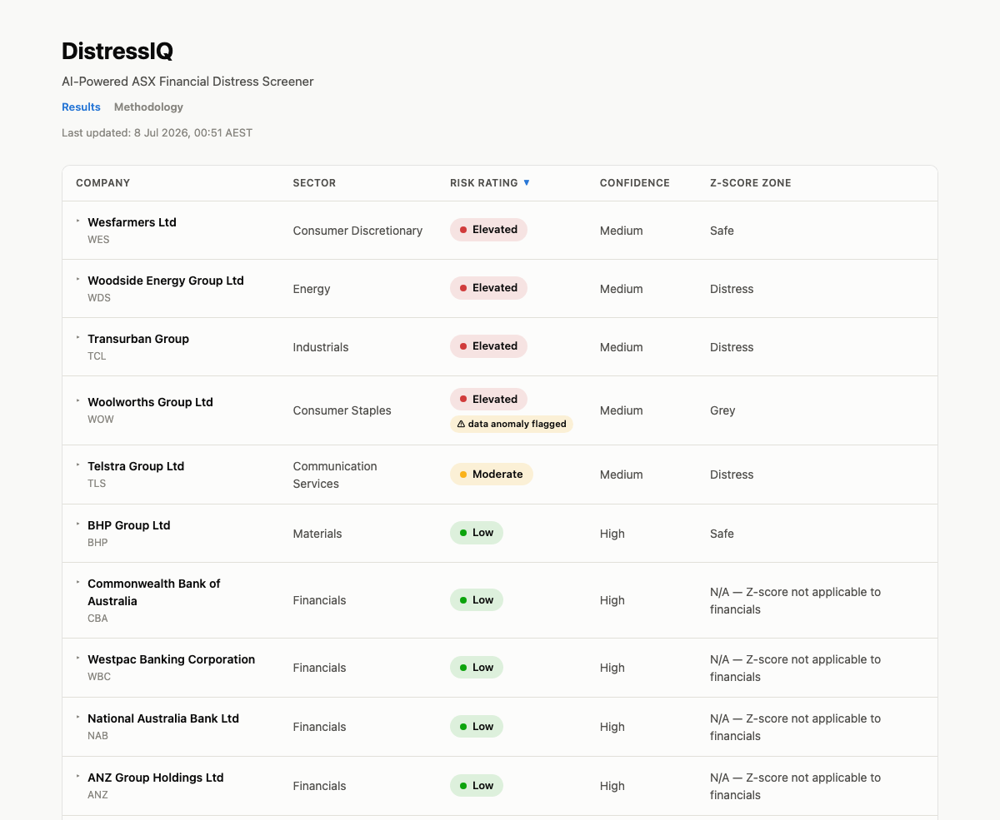

# DistressIQ

**AI-powered financial distress screener for ASX-listed companies.**

Live site: **[tomosowen-eng.github.io/distressiq](https://tomosowen-eng.github.io/distressiq/)**

DistressIQ pulls quarterly/half-yearly fundamentals for ASX-listed companies,
computes a standard set of credit and liquidity ratios, and asks an AI model
(Claude) to turn those ratios — plus several years of trend history — into a
structured, subscriber-style risk write-up: a risk rating, a confidence
level with its reasoning, the specific mechanism driving the rating, the
trend direction, and a concrete watch trigger. The result is a sortable
table where every company can be expanded into a full detail panel.

It's a personal portfolio project built to demonstrate an end-to-end
data → analysis → publishing pipeline, not a commercial product or research
service (see [Disclaimer](#disclaimer)).



## What it does

For each company in the watchlist, the pipeline computes:

| Ratio | What it measures |
|---|---|
| Current Ratio | Can current assets cover current liabilities over the next 12 months? |
| Debt-to-Equity | How much of the company is financed by debt vs. its own capital |
| Net Debt / EBITDA | Roughly, how many years of earnings it would take to pay off net debt |
| Interest Coverage | How comfortably current earnings cover the interest bill |
| Altman Z-Score | A 1968 composite distress score — see [limitations](#the-altman-z-score-and-its-limits) below |

Those ratios, plus up to three years of quarterly revenue/EBIT/debt/cash
history, are sent to Claude with a prompt that forces a fixed output
structure — **Risk Rating, Confidence, Primary Driver, Trend, Watch
Trigger** — so the front end can render each field directly instead of
parsing free text. The model is explicitly instructed to name the specific
distress mechanism (a solvency problem, an earnings shock, a liquidity
timing issue, a governance flag, a cost blowout) rather than restate the
ratios in prose.

The front end also tracks **rating changes between runs**: each run
archives the previous results and diffs the new ratings against them, so a
"Recent rating changes" strip surfaces any company that moved risk tiers
since the prior week, with a "was X, now Y (as of &lt;date&gt;)" note in
that company's detail panel.

## Architecture

```
EODHD Fundamentals API
        │
        ▼
run_pipeline.py            fetch balance sheet + income statement per company,
                            compute the ratio set above, build the Claude prompt,
                            parse the fixed-structure response into typed fields
        │
        ▼
Claude API (Sonnet)        subscriber-style risk write-up per company
        │
        ▼
results.json                run metadata + per-company results + rating-change diff
  (repo root + docs/)
        │
        ▼
docs/index.html            static front end — fetches results.json, renders a
(GitHub Pages)              sortable table with expandable per-company detail panels
```

The whole thing is intentionally dependency-light: standalone Python
scripts (`requests` is the only third-party package) rather than a
framework, and a static HTML/CSS/vanilla-JS front end with no build step —
GitHub Pages serves `docs/` directly.

**Scheduling.** The pipeline runs automatically every **Monday morning via
a macOS `launchd` job** (`run_pipeline_launchd.sh` + a `launchd` plist),
pulling both API keys from the macOS Keychain at run time rather than any
file on disk. It currently scans a 15-company test subset of the ASX 200
(`asx200_watchlist.py`); a `--full` flag switches to the entire ~201-company
index once ready. Publishing a completed run to the live site is currently
a manual commit + push of the refreshed `results.json`.

## Data-integrity safeguards

Fundamentals aggregated from public filings by a third-party data provider
are not always clean, and this project ran into a real example of that
early on: **Woolworths Group's** reported total debt appeared to jump
roughly 55% in a single reporting period, with no acquisition, refinancing,
or other event in the data to explain it. It turned out to be a
lease-liability figure counted twice in the underlying data provider's
field for that one period — not a real financial event.

That incident is now a standing check in the AI prompt: before writing its
assessment, the model scans the historical data for any single-period move
greater than 50% in a major line item that isn't otherwise explained. When
it finds one, instead of inventing a plausible-sounding cause, it's
instructed to:

- name the possibility of a data-quality or reporting artifact directly,
- cap its Confidence at Medium, and
- point its Watch Trigger at confirming that specific figure in the next
  disclosure.

The front end separately scans each write-up for this language and surfaces
a **"⚠ data anomaly flagged"** badge in the results table and detail panel
— visible today on Woolworths Group for exactly this reason.

## The Altman Z-Score, and its limits

The Altman Z-Score used here is the original 1968 formula, calibrated on
public **industrial and manufacturing** companies. Banks, insurers,
exchanges, and REITs have fundamentally different balance sheet
structures — a bank's "debt" is largely customer deposits, not leverage in
the sense the formula assumes — so applying it to those sectors routinely
produces alarming-looking scores that reflect the business model, not
financial distress.

DistressIQ suppresses the Z-Score *zone* label (Safe / Grey / Distress) for
Financials and Real Estate constituents rather than show a misleading
reading. The raw score is still shown in each company's detail panel, and
for those sectors the AI risk rating — not the Z-Score — is the headline
signal.

## Disclaimer

DistressIQ is an educational and portfolio project. All risk ratings,
confidence levels, and written analysis are generated by an AI model from
public financial data and are not reviewed by a human analyst. Nothing in
this repository or on the live site is financial advice, a research report,
or a recommendation to buy, sell, or hold any security. Ratios and scores
(including the Altman Z-Score) may be unreliable for certain sectors — see
each company's detail panel for context. Do your own research and consult
a licensed financial adviser before making investment decisions.

## Repo layout

| Path | Purpose |
|---|---|
| `run_pipeline.py` | Current pipeline orchestrator — fetch, compute, analyze, archive, diff, publish |
| `asx200_watchlist.py` | Static ASX 200 constituent list (name/ticker/sector/index weight) |
| `watchlist.py`, `calculate_ratios.py`, `ai_risk_analysis.py` | Earlier hand-curated, single-purpose predecessors to `run_pipeline.py`, kept for reference |
| `results.json` / `docs/results.json` | Latest pipeline output consumed by the front end |
| `history/` | Archived results from previous runs, used for rating-change detection |
| `docs/index.html` | Results table front end (GitHub Pages) |
| `docs/methodology.html` | Public-facing explanation of the ratios, Z-Score, and AI methodology |
| `inspect_*.py`, `test_*.py` | One-off manual scripts used to probe the EODHD API shape |

No build system or package manifest — everything runs directly with
`python3 <script>.py`; see `CLAUDE.md` for setup and environment variable
details.
